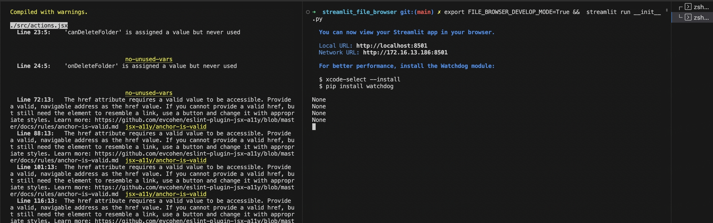
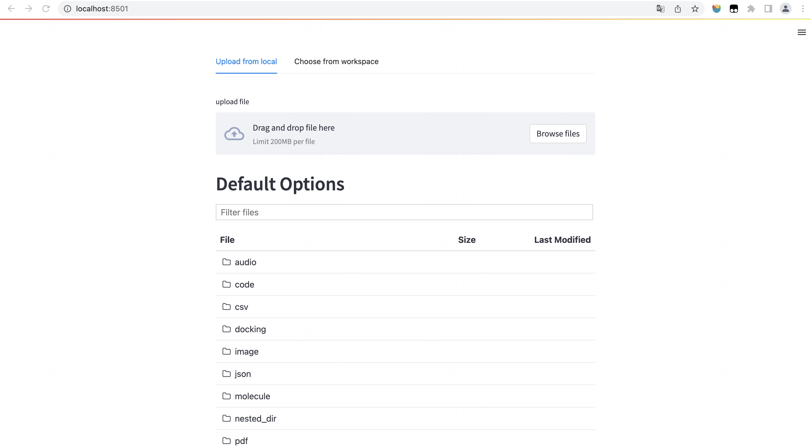
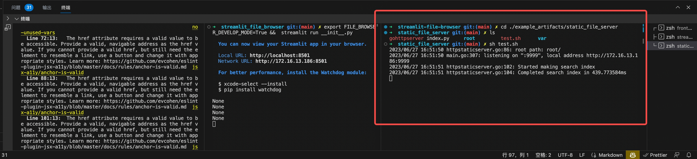
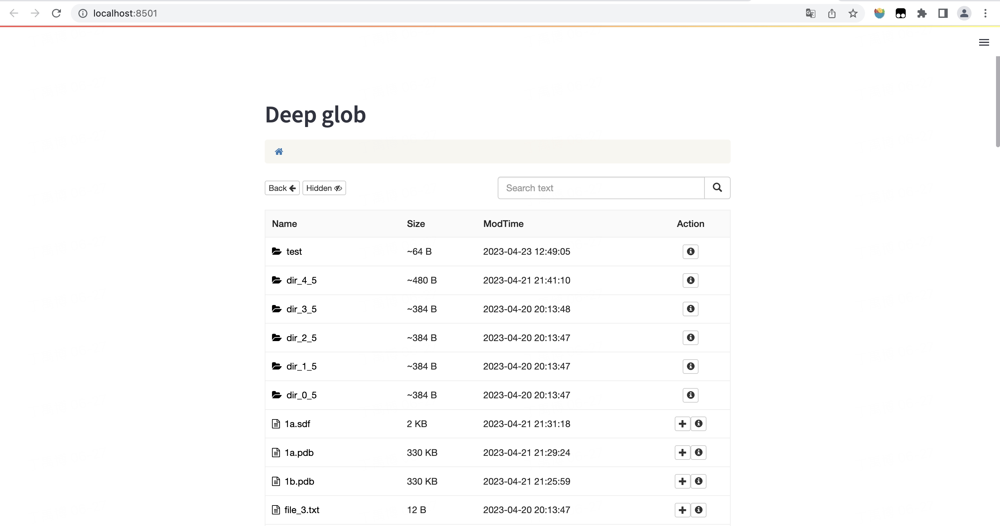

# Streamlit file browser

A streamlit component serve as web file browser from local directory.

## Install

```
pip install streamlit-file-browser
```
## Usage Example


```python
import streamlit as st
from streamlit_file_browser import st_file_browser

st.header('Default Options')
event = st_file_browser("example_artifacts", key='A')
st.write(event)

st.header('With Artifacts Server, Allow choose file, disable download')
event = st_file_browser("example_artifacts", artifacts_site="http://localhost:1024", show_choose_file=True, show_download_file=False, key='B')
st.write(event)

st.header('Show only molecule files')
event = st_file_browser("example_artifacts", artifacts_site="http://localhost:1024", show_choose_file=True, show_download_file=False, glob_patterns=('molecule/*',), key='C')
st.write(event)
```

## API

| name                     | usage                                                                                                                                      | type           | required                                                | default |
|--------------------------|--------------------------------------------------------------------------------------------------------------------------------------------|----------------|---------------------------------------------------------|---------|
| key                      | react key                                                                                                                                  | string         | No. But I suggest giving each component a different key | None    |
| path                     | the path of dir                                                                                                                            | strubg         | Yes                                                     |         |
| show_preview             | if preview the file be clicked                                                                                                             | bool           | No                                                      | True    |
| show_preview_top         | Whether to render the preview above the file browser                                                                                       | bool           | No                                                      | False   |
| glob_patterns            | To control file shows, the usage is the same as the patterns of glob.glob                                                                  | string (regex) | No                                                      | '**/*'    |
| ignore_file_select_event | If ignore the 'file_selected' event                                                                                                        | bool           | No                                                      | False   |
| extentions               | Only show the files included in the extentions                                                                                             | list           | No                                                      | None    |
| show_delete_file         | If show the button of delete file                                                                                                          | bool           | No                                                      | False   |
| show_choose_file         | If show the button of choose file                                                                                                          | bool           | No                                                      | False   |
| show_download_file       | If show the button of download file                                                                                                        | bool           | No                                                      | True    |
| show_new_folder          | If show the button of new folder                                                                                                           | bool           | No                                                      | False   |
| show_upload_file         | If show the button of upload file                                                                                                          | bool           | No                                                      | False   |
| limit                    | File number limit                                                                                                                          | int            | No                                                      | 10000   |
| artifacts_site           | If you don't use the `use_static_file_server` mode, when you want to preview a file, you need to provide a proxy service to find the file  | string         | No                                                      | None    |
| artifacts_download_site  | If you don't use the `use_static_file_server` mode, when you want to download a file, you need to provide a proxy service to find the file | string         | No                                                      | None    |
| use_cache                | If cache file tree                                                                                                                         | bool           | No                                                      | False   |
| use_static_file_server   | If use static file server mode                                                                                                             | bool           | No                                                      | False   |
| static_file_server_path  | Static file server path                                                                                                                    | string         | No                                                      | None    |

<br/>

## Run example
1. Download the repo & enter the repo
```bash
git clone git@github.com:pragmatic-streamlit/streamlit-file-browser.git
cd streamlit-file-browser
```
2. Install frontend package
```bash
cd streamlit_file_browser/frontend/
npm install
```
3. Set develop env
```bash
export FILE_BROWSER_DEVELOP_MODE=True
```
4. Start frontend and python server
```bash
cd streamlit_file_browser/frontend/ && npm run start
cd ../ && streamlit run __init__.py
```



</br>

## Static File Server Mode
Streamlit file browser support custom file server. You can provide a file server path.

#### For example
```python
event = st_file_browser(os.path.join(current_path, "..", "example_artifacts/static_file_server/root"),
    key="deep",
    use_static_file_server=True,
    show_choose_file=True,
    show_delete_file=True,
    show_download_file=False,
    show_new_folder=True,
    show_upload_file=False,
    static_file_server_path="http://localhost:9999/?choose=true",
)
```
There is a demo in this repo, you can enter the `example_artifacts/static_file_server` path and run `sh test.sh` to start the custom file sesrver.



The custom static file server use this repo: https://github.com/y805939188/gohttpserver

It has better performance in terms of function and performance, and you can also directly use this repo as a static file service.
